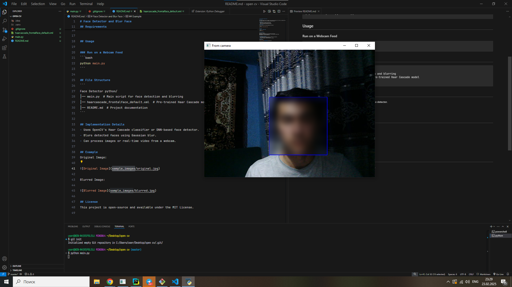

# Face Detector and Blur Face

## Overview
This project detects faces in images or video streams and applies a blur effect to anonymize them. It utilizes OpenCV and a pre-trained face detection model.

## Features
- Detects faces in images and video streams
- Blurs detected faces to protect privacy
- Supports real-time processing with a webcam

## Requirements
Ensure you have the following dependencies installed:

```bash
pip install opencv-python numpy
```

## Usage

### Run on a Webcam Feed
```bash
python main.py
```

## File Structure
```
Face Detector python/
│── main.py  # Main script for face detection and blurring
│── haarcascade_frontalface_default.xml  # Pre-trained Haar Cascade model
│── README.md  # Project documentation
```

## Implementation Details
- Uses OpenCV's Haar Cascade classifier or DNN-based face detector.
- Blurs detected faces using Gaussian blur.
- Can process images or real-time video from a webcam.

## Example
Original Image:



## License
This project is open-source and available under the MIT License.